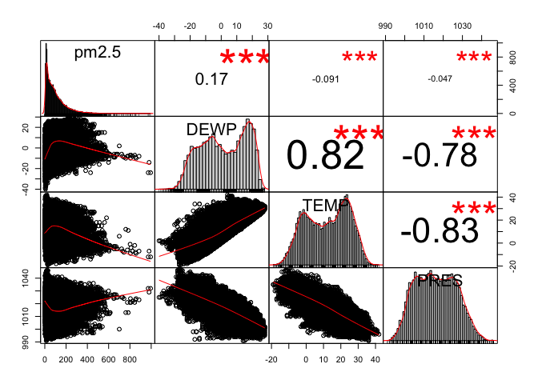
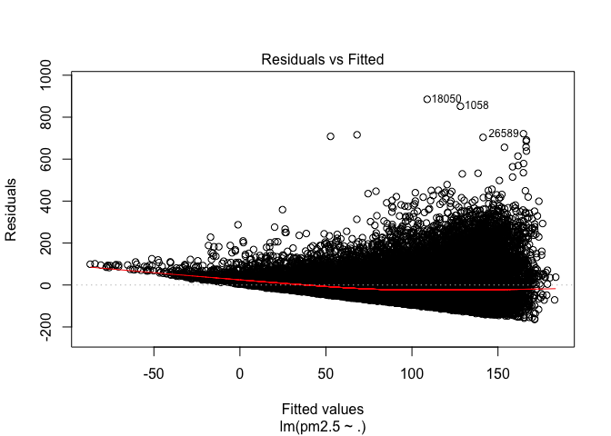
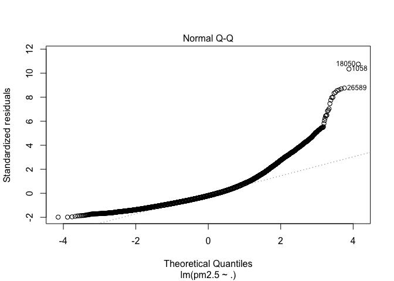
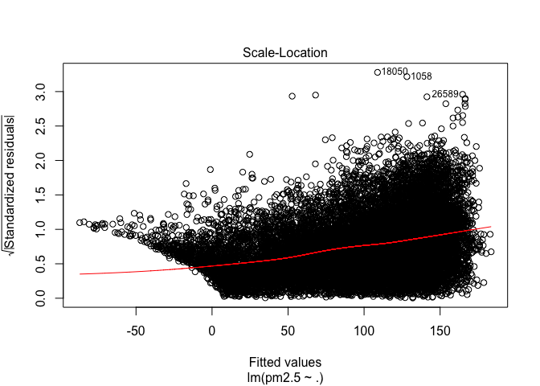
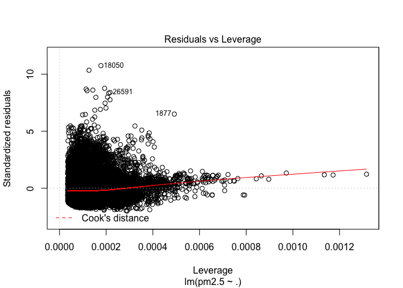
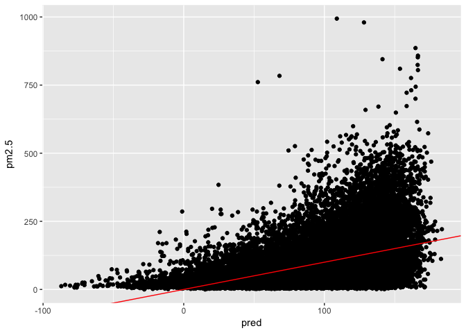
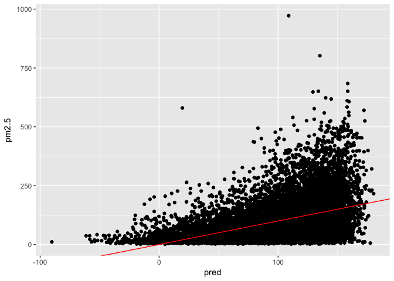

Regression Machine Learning
================

Introduction
------------

``` r
library(PerformanceAnalytics)
library(ggplot2)
library(Metrics)
library(tsensembler)

#reading file
beijing.pm <- read.csv("~/Desktop/learning/ML/PRSA_data_2010.1.1-2014.12.31.csv", stringsAsFactors = FALSE)

#overview of the data
dim(beijing.pm)
```

    ## [1] 43824    13

``` r
head(beijing.pm)
```

    ##   No year month day hour pm2.5 DEWP TEMP PRES cbwd   Iws Is Ir
    ## 1  1 2010     1   1    0    NA  -21  -11 1021   NW  1.79  0  0
    ## 2  2 2010     1   1    1    NA  -21  -12 1020   NW  4.92  0  0
    ## 3  3 2010     1   1    2    NA  -21  -11 1019   NW  6.71  0  0
    ## 4  4 2010     1   1    3    NA  -21  -14 1019   NW  9.84  0  0
    ## 5  5 2010     1   1    4    NA  -20  -12 1018   NW 12.97  0  0
    ## 6  6 2010     1   1    5    NA  -19  -10 1017   NW 16.10  0  0

``` r
tail(beijing.pm)
```

    ##          No year month day hour pm2.5 DEWP TEMP PRES cbwd    Iws Is Ir
    ## 43819 43819 2014    12  31   18    10  -22   -2 1033   NW 226.16  0  0
    ## 43820 43820 2014    12  31   19     8  -23   -2 1034   NW 231.97  0  0
    ## 43821 43821 2014    12  31   20    10  -22   -3 1034   NW 237.78  0  0
    ## 43822 43822 2014    12  31   21    10  -22   -3 1034   NW 242.70  0  0
    ## 43823 43823 2014    12  31   22     8  -22   -4 1034   NW 246.72  0  0
    ## 43824 43824 2014    12  31   23    12  -21   -3 1034   NW 249.85  0  0

``` r
str(beijing.pm)
```

    ## 'data.frame':    43824 obs. of  13 variables:
    ##  $ No   : int  1 2 3 4 5 6 7 8 9 10 ...
    ##  $ year : int  2010 2010 2010 2010 2010 2010 2010 2010 2010 2010 ...
    ##  $ month: int  1 1 1 1 1 1 1 1 1 1 ...
    ##  $ day  : int  1 1 1 1 1 1 1 1 1 1 ...
    ##  $ hour : int  0 1 2 3 4 5 6 7 8 9 ...
    ##  $ pm2.5: int  NA NA NA NA NA NA NA NA NA NA ...
    ##  $ DEWP : int  -21 -21 -21 -21 -20 -19 -19 -19 -19 -20 ...
    ##  $ TEMP : num  -11 -12 -11 -14 -12 -10 -9 -9 -9 -8 ...
    ##  $ PRES : num  1021 1020 1019 1019 1018 ...
    ##  $ cbwd : chr  "NW" "NW" "NW" "NW" ...
    ##  $ Iws  : num  1.79 4.92 6.71 9.84 12.97 ...
    ##  $ Is   : int  0 0 0 0 0 0 0 0 0 0 ...
    ##  $ Ir   : int  0 0 0 0 0 0 0 0 0 0 ...

``` r
summary(beijing.pm)
```

    ##        No             year          month             day       
    ##  Min.   :    1   Min.   :2010   Min.   : 1.000   Min.   : 1.00  
    ##  1st Qu.:10957   1st Qu.:2011   1st Qu.: 4.000   1st Qu.: 8.00  
    ##  Median :21912   Median :2012   Median : 7.000   Median :16.00  
    ##  Mean   :21912   Mean   :2012   Mean   : 6.524   Mean   :15.73  
    ##  3rd Qu.:32868   3rd Qu.:2013   3rd Qu.:10.000   3rd Qu.:23.00  
    ##  Max.   :43824   Max.   :2014   Max.   :12.000   Max.   :31.00  
    ##                                                                 
    ##       hour           pm2.5             DEWP              TEMP       
    ##  Min.   : 0.00   Min.   :  0.00   Min.   :-40.000   Min.   :-19.00  
    ##  1st Qu.: 5.75   1st Qu.: 29.00   1st Qu.:-10.000   1st Qu.:  2.00  
    ##  Median :11.50   Median : 72.00   Median :  2.000   Median : 14.00  
    ##  Mean   :11.50   Mean   : 98.61   Mean   :  1.817   Mean   : 12.45  
    ##  3rd Qu.:17.25   3rd Qu.:137.00   3rd Qu.: 15.000   3rd Qu.: 23.00  
    ##  Max.   :23.00   Max.   :994.00   Max.   : 28.000   Max.   : 42.00  
    ##                  NA's   :2067                                       
    ##       PRES          cbwd                Iws               Is          
    ##  Min.   : 991   Length:43824       Min.   :  0.45   Min.   : 0.00000  
    ##  1st Qu.:1008   Class :character   1st Qu.:  1.79   1st Qu.: 0.00000  
    ##  Median :1016   Mode  :character   Median :  5.37   Median : 0.00000  
    ##  Mean   :1016                      Mean   : 23.89   Mean   : 0.05273  
    ##  3rd Qu.:1025                      3rd Qu.: 21.91   3rd Qu.: 0.00000  
    ##  Max.   :1046                      Max.   :585.60   Max.   :27.00000  
    ##                                                                       
    ##        Ir         
    ##  Min.   : 0.0000  
    ##  1st Qu.: 0.0000  
    ##  Median : 0.0000  
    ##  Mean   : 0.1949  
    ##  3rd Qu.: 0.0000  
    ##  Max.   :36.0000  
    ## 

``` r
#missing values of the data
sum(is.na(beijing.pm))
```

    ## [1] 2067

``` r
(2067/43924) * 100
```

    ## [1] 4.705856

The missing value in the dataset is remove. Since missing value only represents 4.705% of the data. Thus, it does not have the huge impact on the dataset once it is removed

``` r
beijing.pm.omit <- na.omit(beijing.pm)

sum(is.na(beijing.pm.omit))
```

    ## [1] 0

``` r
summary(beijing.pm.omit)
```

    ##        No             year          month             day       
    ##  Min.   :   25   Min.   :2010   Min.   : 1.000   Min.   : 1.00  
    ##  1st Qu.:11464   1st Qu.:2011   1st Qu.: 4.000   1st Qu.: 8.00  
    ##  Median :22435   Median :2012   Median : 7.000   Median :16.00  
    ##  Mean   :22279   Mean   :2012   Mean   : 6.514   Mean   :15.69  
    ##  3rd Qu.:33262   3rd Qu.:2013   3rd Qu.:10.000   3rd Qu.:23.00  
    ##  Max.   :43824   Max.   :2014   Max.   :12.000   Max.   :31.00  
    ##       hour          pm2.5             DEWP             TEMP      
    ##  Min.   : 0.0   Min.   :  0.00   Min.   :-40.00   Min.   :-19.0  
    ##  1st Qu.: 5.0   1st Qu.: 29.00   1st Qu.:-10.00   1st Qu.:  2.0  
    ##  Median :12.0   Median : 72.00   Median :  2.00   Median : 14.0  
    ##  Mean   :11.5   Mean   : 98.61   Mean   :  1.75   Mean   : 12.4  
    ##  3rd Qu.:18.0   3rd Qu.:137.00   3rd Qu.: 15.00   3rd Qu.: 23.0  
    ##  Max.   :23.0   Max.   :994.00   Max.   : 28.00   Max.   : 42.0  
    ##       PRES          cbwd                Iws               Is          
    ##  Min.   : 991   Length:41757       Min.   :  0.45   Min.   : 0.00000  
    ##  1st Qu.:1008   Class :character   1st Qu.:  1.79   1st Qu.: 0.00000  
    ##  Median :1016   Mode  :character   Median :  5.37   Median : 0.00000  
    ##  Mean   :1016                      Mean   : 23.87   Mean   : 0.05534  
    ##  3rd Qu.:1025                      3rd Qu.: 21.91   3rd Qu.: 0.00000  
    ##  Max.   :1046                      Max.   :565.49   Max.   :27.00000  
    ##        Ir         
    ##  Min.   : 0.0000  
    ##  1st Qu.: 0.0000  
    ##  Median : 0.0000  
    ##  Mean   : 0.1949  
    ##  3rd Qu.: 0.0000  
    ##  Max.   :36.0000

Exploratory data analysis
-------------------------

``` r
#correlation
#get the desire variables

beijing.pm.corr <- beijing.pm.omit[,c(6,7,8,9)]

chart.Correlation(beijing.pm.corr, histogram=TRUE, method = "pearson")
```



The correlation shows that PM2.5 is highly correlated with Dew Point, Temperature and Pressure.

### Preparing for training and test set

``` r
#shuffle dataset and create train and test set
set.seed(1234567)
n <- nrow(beijing.pm.corr)
shuffled <- beijing.pm.corr[sample(n),]

train <- shuffled[1:round(0.7 * n),]
test <- shuffled[(round(0.7 * n) + 1):n,]

summary(train)
```

    ##      pm2.5             DEWP              TEMP             PRES     
    ##  Min.   :  0.00   Min.   :-38.000   Min.   :-19.00   Min.   : 991  
    ##  1st Qu.: 29.00   1st Qu.:-10.000   1st Qu.:  2.00   1st Qu.:1008  
    ##  Median : 72.00   Median :  2.000   Median : 13.00   Median :1016  
    ##  Mean   : 98.85   Mean   :  1.727   Mean   : 12.37   Mean   :1016  
    ##  3rd Qu.:138.00   3rd Qu.: 15.000   3rd Qu.: 23.00   3rd Qu.:1025  
    ##  Max.   :994.00   Max.   : 28.000   Max.   : 42.00   Max.   :1046

``` r
summary(test)
```

    ##      pm2.5             DEWP              TEMP             PRES     
    ##  Min.   :  1.00   Min.   :-40.000   Min.   :-19.00   Min.   : 993  
    ##  1st Qu.: 29.00   1st Qu.:-10.000   1st Qu.:  2.00   1st Qu.:1008  
    ##  Median : 72.00   Median :  2.000   Median : 14.00   Median :1016  
    ##  Mean   : 98.06   Mean   :  1.805   Mean   : 12.47   Mean   :1016  
    ##  3rd Qu.:136.00   3rd Qu.: 15.000   3rd Qu.: 23.00   3rd Qu.:1025  
    ##  Max.   :972.00   Max.   : 28.000   Max.   : 41.00   Max.   :1046

Trainning the model
-------------------

``` r
model.train <- lm(pm2.5 ~ ., data = train)
round(model.train$coefficients,3)
```

    ## (Intercept)        DEWP        TEMP        PRES 
    ##    1713.325       4.584      -6.218      -1.520

Checking confidence interval

``` r
round(confint(model.train, level = 0.95), 3)
```

    ##                2.5 %   97.5 %
    ## (Intercept) 1538.786 1887.864
    ## DEWP           4.463    4.705
    ## TEMP          -6.378   -6.057
    ## PRES          -1.691   -1.350

Check the model performance

``` r
summary(model.train)
```

    ## 
    ## Call:
    ## lm(formula = pm2.5 ~ ., data = train)
    ## 
    ## Residuals:
    ##     Min      1Q  Median      3Q     Max 
    ## -163.27  -54.27  -16.49   33.55  885.15 
    ## 
    ## Coefficients:
    ##               Estimate Std. Error t value Pr(>|t|)    
    ## (Intercept) 1713.32474   89.04853   19.24   <2e-16 ***
    ## DEWP           4.58434    0.06178   74.21   <2e-16 ***
    ## TEMP          -6.21786    0.08193  -75.89   <2e-16 ***
    ## PRES          -1.52041    0.08705  -17.47   <2e-16 ***
    ## ---
    ## Signif. codes:  0 '***' 0.001 '**' 0.01 '*' 0.05 '.' 0.1 ' ' 1
    ## 
    ## Residual standard error: 82.31 on 29226 degrees of freedom
    ## Multiple R-squared:  0.2051, Adjusted R-squared:  0.205 
    ## F-statistic:  2513 on 3 and 29226 DF,  p-value: < 2.2e-16

``` r
plot(model.train)
```



Assessing test set performance

``` r
pred <- predict(model.train, test)
head(pred)
```

    ##     16266     41569     13016     26336     21611      1002 
    ##  82.01503 147.12752 144.74596  90.65207 110.72893  46.69768

Plotting of train and test data against actural performance

``` r
train$pred <- predict(model.train)
test$pred <- predict(model.train, test)

plot.train <- ggplot(train, aes(x = pred, y = pm2.5)) +
  geom_point() +
  geom_abline(color = "red")

plot.test <- ggplot(test, aes(x = pred, y = pm2.5)) +
  geom_point() +
  geom_abline(color = "red")

plot.train
```



``` r
plot.test
```



``` r
# Evaluate the rmse on both training and test data and print them
(rmse_train <- rmse(train$pred, train$pm2.5))
```

    ## [1] 82.30924

``` r
(rmse_test <- rmse(test$pred, test$pm2.5))
```

    ## [1] 81.58402

``` r
# Evaluate the r-squared on both training and test data.and print them
train.rss <- sum((train$pred - train$pm2.5) ^ 2)
train.tss <- sum((train$pm2.5 - mean(train$pm2.5)) ^ 2)
(rsq <- 1 - train.rss/train.tss)
```

    ## [1] 0.2050666

``` r
test.rss <- sum((test$pred - test$pm2.5) ^ 2)
test.tss <- sum((test$pm2.5 - mean(test$pm2.5)) ^ 2)
(rsq <- 1 - test.rss/test.tss)
```

    ## [1] 0.2035787
